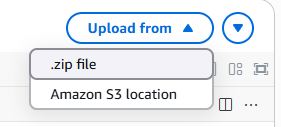
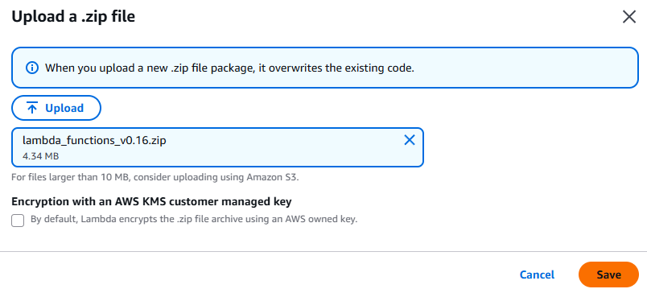

# UPDATE

## Updating the Skill
1. Navigate to the [AWS Lambda console](https://us-east-1.console.aws.amazon.com/lambda/home), and click on your function:
   - On the right side, click `Upload from` and select `Zip file`;

      

2. Then click `Save`;

      

3. **Attention**, review the version update log or the [installation instructions](INSTALLATION.md) to check if any environment variables have been changed or added!
4. The changes take effect immediately. Test it on your nearest Alexa device. If it doesn't work, click `Deploy` as shown in the image below:

   
5. Done! 😊